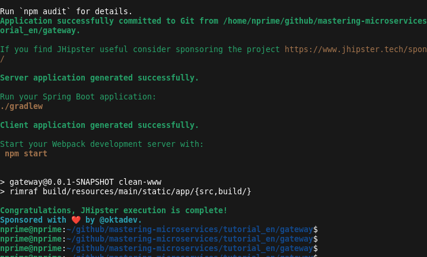

# 1. Firstname, Lastname, Github ID and Email address of the 3 members of the homework group. Link to the Github repositories of your homework.

* Junior N'nane (https://gihub.com/nprime496) / Mail  : dieudonne-junior.n-nane@grenoble-inp.org
* Cheikh Saliou Diagne (https://gihub.com/diagnecs) / Mail : cheikh-saliou.diagne@grenoble-inp.org

Repo of Homework:

https://github.com/nprime496/mastering-microservices


# 2. Deployment of Microservices with JHipster on GCP (screenshot of your GCP console)

Generation and deploymen of services was done following following the tutorial `mastering-microservices/microservices/microservices.md`




Services were deployed using Kubernetes cluster on Google Cloud Platform.


Services were successfully deployed:


## (bonus) pushing to gcloud registry 

We also tested pushing container images to Google Cloud Container Registry.

```
docker tag productorder gcr.io/$PROJECTID/productorder
docker push gcr.io/$PROJECTID/productorder
```


# 3. Enabling scalability on GCP for one microservice (screenshot of your GCP console)

[Scaling an application](https://cloud.google.com/kubernetes-engine/docs/how-to/scaling-apps)


we choose to scale `invoice` app.

`kubectl scale deployments -n store invoice --replicas 4`


We can see that it the number of possible instance was upgraded on GCP as well:


# 4. Monitoring dashboard (screenshot of prometheus+grafana dashboard OR screenshot of your GPC dashboard)

We monitored application using Prometheus:


And checked health using GCP:


# 5. Load injection with Gatling for demonstrating scalability (screenshot of grafana OR screenshot of your GPC dashboard + link to your gatling report)


Reports generated are available in [result folder](./gatling-charts-highcharts-bundle-2.3.1/results/)


